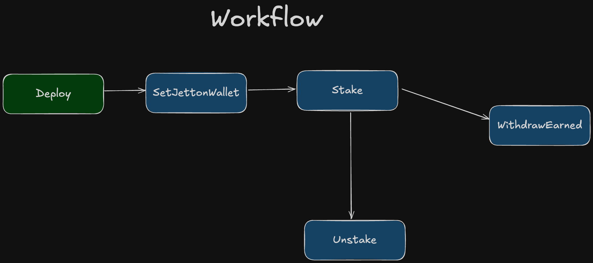
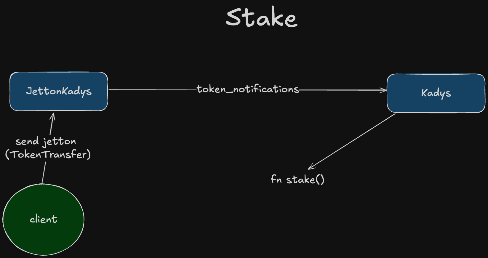
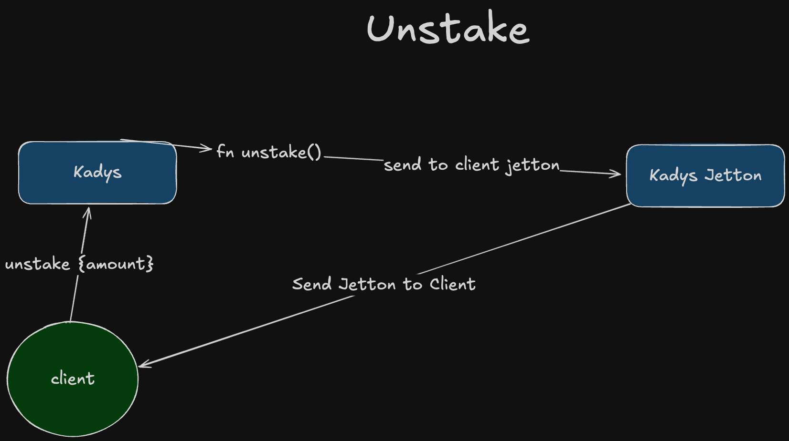
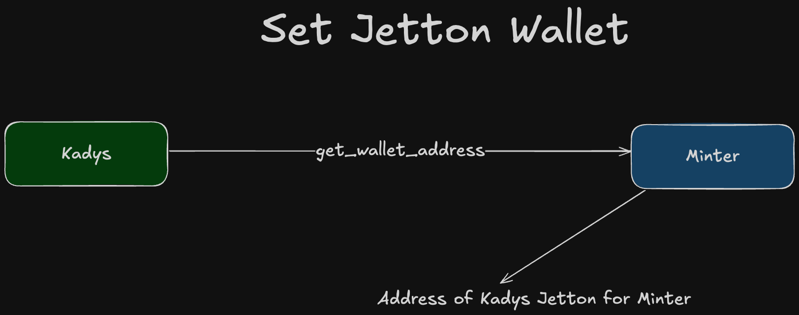
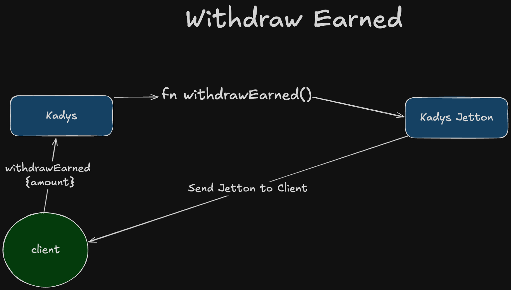
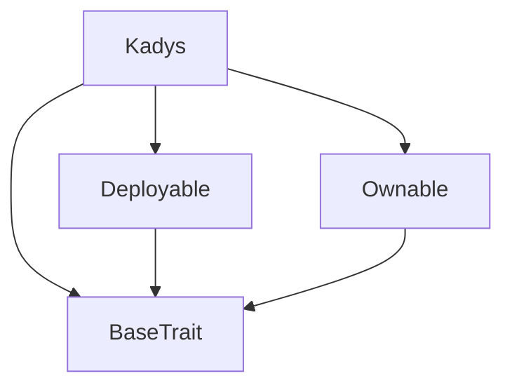
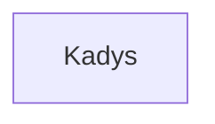

# KadysTON

## Project structure

-   `contracts` - source code of all the smart contracts of the project and their dependencies.
-   `wrappers` - wrapper classes (implementing `Contract` from ton-core) for the contracts, including any [de]serialization primitives and compilation functions.
-   `tests` - tests for the contracts.
-   `scripts` - scripts used by the project, mainly the deployment scripts.

## How to use
### Environment 
Fill the `.env` file with variables from `.env.example`
### Build

`npx blueprint build` or `npm run build`

### Test

`npx blueprint test` or `npm run test`

### Deploy or run another script

`npx blueprint run` or `yarn blueprint run`

## Kadys Contract Overview
## Visualisation of each script
### Roadmap / Workflow

### Stake

### Unstake

### SetJettonWallet

### WithdrawEarned

### Key Features
1. **User Staking and Earnings Management**: The contract maintains mappings to store user stakes and their respective earnings, allowing users to easily manage and track their investments and rewards.
2. **Dynamic Yield Calculation**: The annual percentage yield (APY) can be adjusted by the contract owner, influencing how rewards are calculated for each staker based on the duration and size of their stake.
3. **Owner Controls**: Special permissions are reserved for the contract owner, such as updating APY, withdrawing contract balance, and setting jetton wallet addresses.
4. **Jetton Wallet Integration**: The contract can interact with a designated jetton wallet, facilitating the receipt and transfer of tokens based on user actions like staking and unstaking.

### Operations
1. **Staking Tokens**: Users can deposit tokens into the contract, which updates their stake balance and recalculates their rewards accordingly.
2. **Unstaking Tokens**: Users can withdraw their staked tokens, which adjusts their stake balance downwards and updates their claimed rewards.
3. **Withdraw Earned Rewards**: Users can withdraw the rewards they've earned up to the present moment.
4. **Administrative Functions**: The owner can change the yearly percentage, update jetton wallet addresses, and withdraw funds from the contract for operational expenses or other purposes.

### Security Measures
- The contract includes multiple `require` statements to ensure operations are performed by valid and authorized users.
- Updates to critical parameters (like APY or jetton wallet address) are restricted to the owner, preventing unauthorized adjustments.

### Event Handling
- It uses blockchain events to log actions such as staking and unstaking, providing transparency and traceability of transactions.

# TACT Compilation Report
Contract: Kadys
BOC Size: 2981 bytes

# Types
Total Types: 24

## StateInit
TLB: `_ code:^cell data:^cell = StateInit`
Signature: `StateInit{code:^cell,data:^cell}`

## Context
TLB: `_ bounced:bool sender:address value:int257 raw:^slice = Context`
Signature: `Context{bounced:bool,sender:address,value:int257,raw:^slice}`

## SendParameters
TLB: `_ bounce:bool to:address value:int257 mode:int257 body:Maybe ^cell code:Maybe ^cell data:Maybe ^cell = SendParameters`
Signature: `SendParameters{bounce:bool,to:address,value:int257,mode:int257,body:Maybe ^cell,code:Maybe ^cell,data:Maybe ^cell}`

## Deploy
TLB: `deploy#946a98b6 queryId:uint64 = Deploy`
Signature: `Deploy{queryId:uint64}`

## DeployOk
TLB: `deploy_ok#aff90f57 queryId:uint64 = DeployOk`
Signature: `DeployOk{queryId:uint64}`

## FactoryDeploy
TLB: `factory_deploy#6d0ff13b queryId:uint64 cashback:address = FactoryDeploy`
Signature: `FactoryDeploy{queryId:uint64,cashback:address}`

## ChangeOwner
TLB: `change_owner#819dbe99 queryId:uint64 newOwner:address = ChangeOwner`
Signature: `ChangeOwner{queryId:uint64,newOwner:address}`

## ChangeOwnerOk
TLB: `change_owner_ok#327b2b4a queryId:uint64 newOwner:address = ChangeOwnerOk`
Signature: `ChangeOwnerOk{queryId:uint64,newOwner:address}`

## UserStake
TLB: `_ lastDepositAt:int257 totalDeposit:int257 = UserStake`
Signature: `UserStake{lastDepositAt:int257,totalDeposit:int257}`

## Withdrawal
TLB: `_ address:address amount:int257 = Withdrawal`
Signature: `Withdrawal{address:address,amount:int257}`

## Unstake
TLB: `unstake#ba522821 amount:int257 = Unstake`
Signature: `Unstake{amount:int257}`

## Withdraw
TLB: `withdraw#94cc7430 amount:uint64 = Withdraw`
Signature: `Withdraw{amount:uint64}`

## ChangeYearlyPercent
TLB: `change_yearly_percent#dec9e827 newPercent:uint32 = ChangeYearlyPercent`
Signature: `ChangeYearlyPercent{newPercent:uint32}`

## StakeEvent
TLB: `stake_event#10027f6d address:address amount:int257 = StakeEvent`
Signature: `StakeEvent{address:address,amount:int257}`

## UnstakeEvent
TLB: `unstake_event#dadb8417 address:address amount:int257 = UnstakeEvent`
Signature: `UnstakeEvent{address:address,amount:int257}`

## WithdrawEarned
TLB: `withdraw_earned#2e04b07e amount:int257 = WithdrawEarned`
Signature: `WithdrawEarned{amount:int257}`

## TokenTransfer
TLB: `token_transfer#0f8a7ea5 queryId:uint64 amount:coins destination:address response_destination:address custom_payload:Maybe ^cell forward_ton_amount:coins forward_payload:remainder<slice> = TokenTransfer`
Signature: `TokenTransfer{queryId:uint64,amount:coins,destination:address,response_destination:address,custom_payload:Maybe ^cell,forward_ton_amount:coins,forward_payload:remainder<slice>}`

## TokenTransferInternal
TLB: `token_transfer_internal#178d4519 queryId:uint64 amount:coins from:address response_destination:Maybe address forward_ton_amount:coins forward_payload:remainder<slice> = TokenTransferInternal`
Signature: `TokenTransferInternal{queryId:uint64,amount:coins,from:address,response_destination:Maybe address,forward_ton_amount:coins,forward_payload:remainder<slice>}`

## TokenNotification
TLB: `token_notification#7362d09c queryId:uint64 amount:coins sender:address forward_payload:remainder<slice> = TokenNotification`
Signature: `TokenNotification{queryId:uint64,amount:coins,sender:address,forward_payload:remainder<slice>}`

## TokenBurn
TLB: `token_burn#595f07bc queryId:uint64 amount:coins owner:address response_destination:address = TokenBurn`
Signature: `TokenBurn{queryId:uint64,amount:coins,owner:address,response_destination:address}`

## TokenBurnNotification
TLB: `token_burn_notification#7bdd97de queryId:uint64 amount:coins owner:address response_destination:Maybe address = TokenBurnNotification`
Signature: `TokenBurnNotification{queryId:uint64,amount:coins,owner:address,response_destination:Maybe address}`

## TokenExcesses
TLB: `token_excesses#d53276db queryId:uint64 = TokenExcesses`
Signature: `TokenExcesses{queryId:uint64}`

## TokenUpdateContent
TLB: `token_update_content#af1ca26a content:^cell = TokenUpdateContent`
Signature: `TokenUpdateContent{content:^cell}`

## SetContractJettonWallet
TLB: `set_contract_jetton_wallet#d33f18af wallet:address = SetContractJettonWallet`
Signature: `SetContractJettonWallet{wallet:address}`

# Get Methods
Total Get Methods: 9

## earnedOfAddress
Argument: user

## balanceOfAddress
Argument: user

## balances

## earned

## claimedByAddress
Argument: user

## totalSupply

## balance

## jettonWallet

## owner

# Error Codes
2: Stack underflow
3: Stack overflow
4: Integer overflow
5: Integer out of expected range
6: Invalid opcode
7: Type check error
8: Cell overflow
9: Cell underflow
10: Dictionary error
13: Out of gas error
32: Method ID not found
34: Action is invalid or not supported
37: Not enough TON
38: Not enough extra-currencies
128: Null reference exception
129: Invalid serialization prefix
130: Invalid incoming message
131: Constraints error
132: Access denied
133: Contract stopped
134: Invalid argument
135: Code of a contract was not found
136: Invalid address
137: Masterchain support is not enabled for this contract
5157: Amount is above the staked value
7177: User not found
10309: Not from the jetton wallet
10603: Balance is less than msg.amount
15241: Amount is above the earned value
22276: Only owner is allowed to call ChangeYearlyPercent
26121: Only owner is allowed to set contractJettonWallet
27921: Only owner is allowed to withdraw
29436: Jetton address must be sent
33670: User not found when calculating rewards
53383: New yearly percent must be above zero
61833: Amount must be above zero

# Trait Inheritance Diagram

# Contract Dependency Diagram

